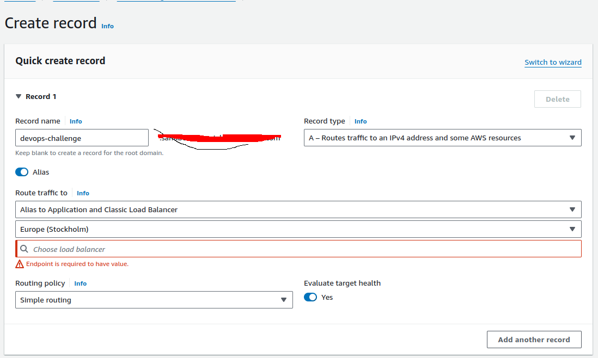

# Let's Get Checked - IaC Challenge


## Description
This repository contains the code for the IaC challenge for the DevOps Engineer role at Let's Get Checked. The goal is create [AWS EKS](https://docs.aws.amazon.com/eks/latest/userguide/what-is-eks.html) cluster using Terraform and deploy a simple application to it using Helm.

## Table of Contents
- [Requirements](#requirements)
- [Kubernetes Cluster](#kubernetes)
- [Helm](#helm)
- [Improvements](#possible-improvements)


## Requirements
- [Terraform](https://developer.hashicorp.com/terraform/tutorials/aws-get-started/install-cli)
- [AWS CLI](https://docs.aws.amazon.com/cli/latest/userguide/install-cliv2.html)
- [kubectl](https://kubernetes.io/docs/tasks/tools/install-kubectl/)
- [Helm](https://helm.sh/docs/intro/install/)
- [AWS credentials configured](https://docs.aws.amazon.com/cli/latest/userguide/cli-chap-configure.html)


## Kubernetes

Edit the [variables.tf](variables.tf) file to set the desired values for the variables. Pay attention to the `region` variable, as it will be used to create the cluster in the specified region and also to the `vpc_data` object variable that defines the CIDR.

Run the following command to initialize the Terraform project:
```bash
terraform init
```


Run the following command and check the output to make sure that the resources that will be created are the ones you expect:
```bash
terraform plan
```

Run the following command to create the resources, this will take a few minutes:
```bash
terraform apply  
```

Get the credentials to manage the cluster:
```bash
aws eks --region $(terraform output -raw region) update-kubeconfig --name $(terraform output -raw cluster_name)
```

Check if the cluster is up and running:
```bash
kubectl get nodes && kubectl get pods --all-namespaces
```

Ensure you are using the latest version of aws cli and kubectl otherwise the previous command might fail.

Install metrics server (required for autoscaler):
```bash
kubectl apply -f https://github.com/kubernetes-sigs/metrics-server/releases/latest/download/components.yaml
```


## Helm

Edit the [Values.yaml](helm/lgc-challenge/values.yaml) file to set the desired values for the variables. Change the ingress host to match the one you want to use if needed.

This helm chart will deploy a simple nginx image and expose the port 80 using an ingress. The ingress will be created using the aws alb ingress controller. The ingress will be created in the same VPC as the EKS cluster.

Run the following command to install the helm chart:
```bash
helm install lgc-challenge helm/lgc-challenge
```

The output of the previous command will show the ingress hostname. You can also get it by running the following command:
```bash
kubectl get ingress
```

You can access the application using the ingress hostname on port 80. It might take a few minutes for the ingress to be created and the DNS to be propagated.

## Manual steps

Create a DNS record for the ingress hostname.

Got to Route53 and create a new record similar to the image below


Fill the choose load balancer field with the name of the load balancer created by the ingress controller.

## Possible Improvements

1. Install the metric server using Terrafrom or Helm. [Possible soluttion](https://github.com/mateothegreat/terraform-kubernetes-metrics-server) but requires a look in the code to understand how it works and check if there is nothing malicious.

2. Play with taint/tolerants and security groups to make the cluster more secure.

3. Make the [API server private](https://docs.aws.amazon.com/eks/latest/userguide/cluster-endpoint.html#private-access).

4. Use [ExternalDNS](https://kubernetes-sigs.github.io/external-dns/v0.12.0/tutorials/aws/#manifest-for-clusters-with-rbac-enabled) to create the DNS record for the ingress automatically.


## Troubleshooting

1. Make sure you are using at least kuberneters 1.25 otherwise the helm command mitght fail.

2. Sometimes the `terraform destroy` command fails to delete the EKS cluster with errors related to the subnets (subnets fail to delete due violations). To avoid this issue, try to delete the kubernetes resources before delete the cluster.
```bash
helm uninstall lgc-challenge
terraform destroy
```